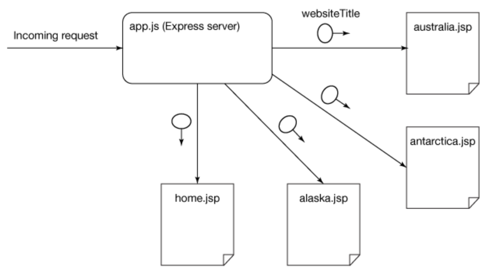
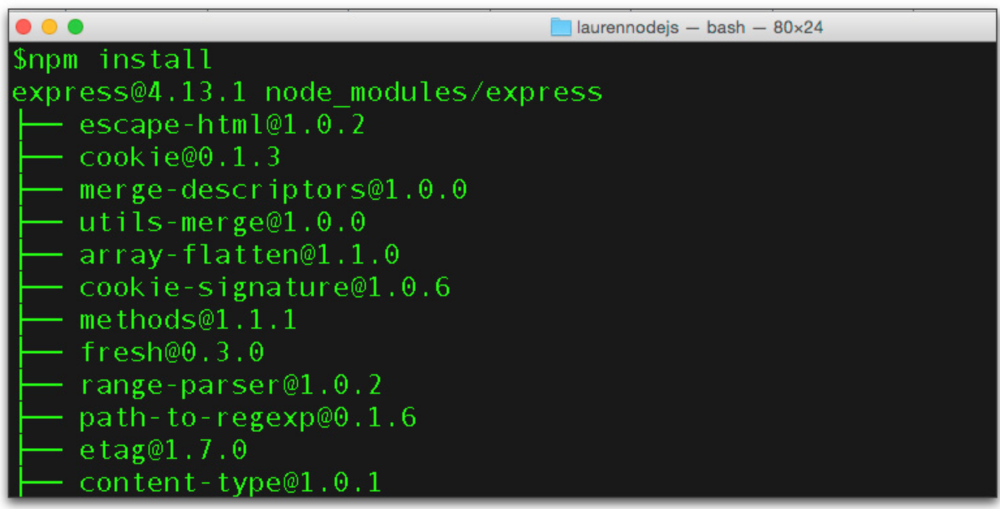
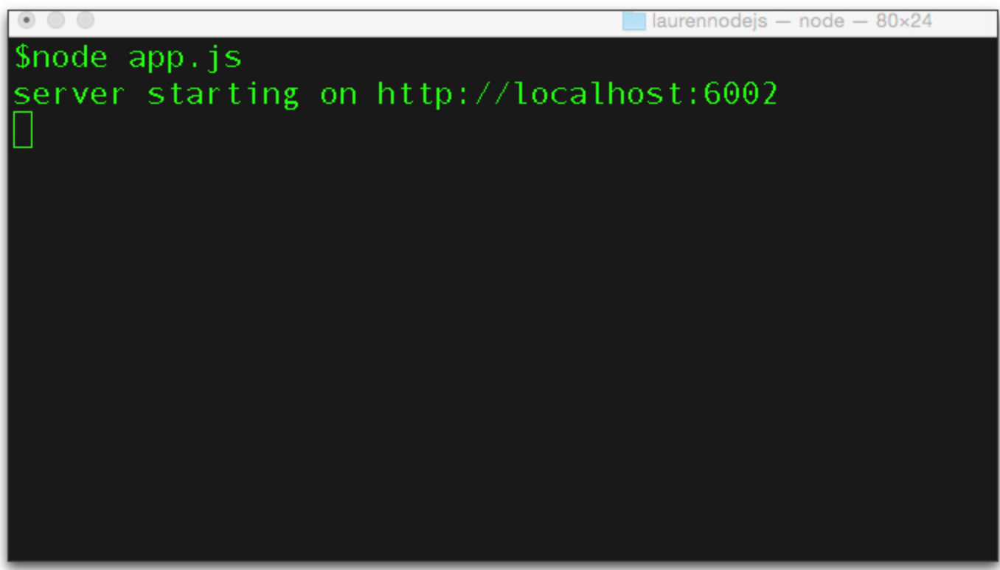
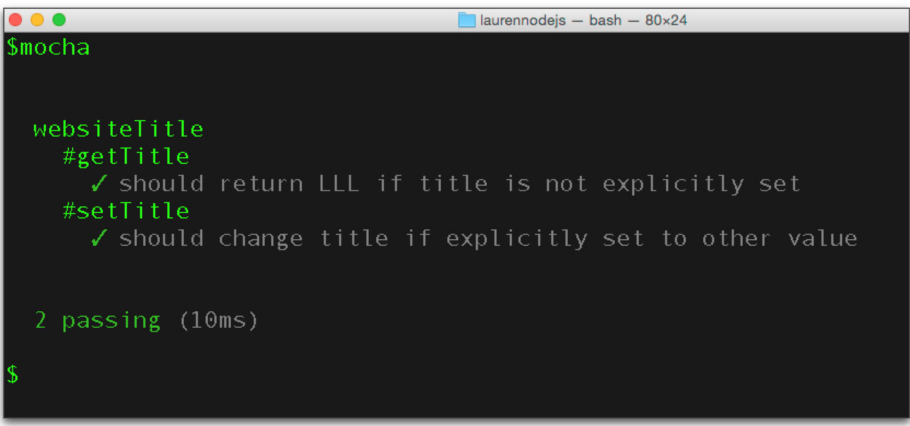

# Applications-on-CloudFoundry
IBM Bluemix is where enterprise developers build, run, scale, and manage applications. Ready to start creating your own apps on Bluemix? This tutorial walks you through the steps for hosting you application. We will go through the basic steps to launch Java, Node and PHP applications. You can pick the language you are comfortable with to go through the steps. After that, we will consume the services provided by Bluemix.
## Scenarios
* **[Deploy a sample Java app](#one)**
* **[Deploy a sample JS app](#two)**
* **[Deploy a sample PHP app](#three)**
## Included components
IBM Bluemix
Cloud Foundry

## Prerequisites
[Create an IBM Bluemix account](https://console.ng.bluemix.net/).  
After that, please download the [Bluemix CLI.](http://clis.ng.bluemix.net/ui/home.html)    
Make sure you run <kbd class="ph userinput">bx login</kbd> command and create the org and space for the demo.   

## Deploy a sample JS app <a name="two"></a>
### Technology involved:
[Node.js](http://nodejs.org/download/) 0.12.6 or later   
A text editor, preferably one with JavaScript syntax highlighting, such as Sublime Text (available in a free trial version) or an open source editor such as Atom.

#### 1.[Download the code](http://www.ibm.com/developerworks/apps/download/index.jsp?contentid=1013070&filename=nodejstutorial1.zip&method=http&locale=)for the sample Node.js web app, nodejstutorial1.zip.

Save nodejstutorial1.zip to your computer and extract its contents, which consists of the following files and directories:
* **app.js**, the main executable of the app, starts the Express server that handles web requests.
* **websitetitle.js** is a simple module that supplies the text for the website's title.
* **package.json** describes your Node.js project and specifies all its dependencies. This file is processed by the standard npm dependency manager.
* **views** is a directory that contains templates of the pages that constitute the app. Each template file can contain dynamic elements that are rendered on the fly with incoming requests.
* **public** is a directory that contains all the static assets of the app, which can include CSS, images, and client-side JavaScript code that runs on the browser.
* **test** is a directory that contains unit tests for the websiteTitle module.

#### 2. Deploy the app to Bluemix

This app, like most Node.js web apps, can be deployed immediately to Bluemix with no additional modification or configuration. You'll deploy it now to Bluemix:   
Make sure you are logged into your Bluemix account.(To check, run <kbd class="ph userinput">bx login</kbd>)
<pre>
bx cf push <b><i>app-name</i></b>
</pre>   
**The name you choose for your application must be unique on Bluemix — not used by any other Bluemix user. You'll get an error if the name (called a route) is taken.**   

The command that you just ran will: 
* Uploads the app to Bluemix
* Runs the IBM SDK for Node.js buildpack in Bluemix
* Starts your Express server instance, with your app loaded, in Bluemix
*Maps a route to your running app, enabling the app to be accessed over the Internet at the URL **https://<b><i>app-name</i></b>.mybluemix.net/**

Open **https://<b><i>app-name</i></b>.mybluemix.net/** in your browser to try out the app — a simple web store called Lauren's Lovely Landscapes. The store currently sells three prints; each print's page displays the associated name, image, and price.

#### 3. Examine the code structure
Starting with this step, you'll begin to examine and modify the code. A syntax-highlighting editor with multiple-tabs support makes it much easier to work with the multiple JavaScript and template source code files.
This diagram shows how the app works:


<br clear="all" />

Each web request for a page of the Lauren's Lovely Landscapes store is routed by your code to one of the templates. When routing to the template, your code attaches a JavaScript object that contains website title information. The template uses this object to render its title (Lauren's Lovely Landscapes).

In app.js, you can see the code that routes requests to a template, together with a variable containing the title from the websiteTitle object:
```
app.get('/', function (req, res) {
  res.render('home', {title: websiteTitle.getTitle()});
});
app.get('/alaska', function (req, res) {
  res.render('alaska',  {title: websiteTitle.getTitle()});
});
app.get('/antarctica', function (req, res) {
  res.render('antarctica',  {title: websiteTitle.getTitle()});
});
app.get('/australia', function (req, res) {
  res.render('australia',  {title: websiteTitle.getTitle()});
});
```
In this case, each of the four paths —/, /antarctica, /alaska, and /australia— routes to its corresponding template, along with the attached website title.

If you examine one of the templates — say, alaska.jade — you can see the use of a Jade template variable to render the title:
```
<head>
    <title> ${title} </title>
...
```
When you start the Express server, it listens on a port for incoming requests. The port used by Bluemix to connect your app to the Internet can change every time you deploy the app. However, Bluemix provides a PORT environment variable that tells the app which port to listen to. In app.js, you can see the code that fetches the environment variable and listens at the specified port:
```
var appEnv = cfenv.getAppEnv();
app.listen(appEnv.port, appEnv.bind, function() {
...
}
```
#### 4. Run the app on your computer
* At the root directory of your app, run:
```
npm install
```
This is the standard way to tell npm to look into the package.json file and then download and install all dependencies of this app. npm creates a node_modules directory and places all the downloaded dependencies there: 


<br clear="all" />

* Start the app in the Express server:
```
node app.js
```
At the command console, note the port that the Express server is running on (http://localhost:6002/ in this example): 


<br clear="all" />

* Point a browser to the Express server at http://localhost:port_number
* Try out this instance of the application and see if you notice any difference from the Bluemix-hosted one. Because you're looking at the same app, produced with the same code, there should be no noticeable differences between the two.

#### 5. Run unit tests
It's good Node.js coding practice to write unit tests for your modules.

* If you don't already have the mocha unit-testing framework installed on your system, run this command to install it:
```
    npm install mocha -g
```
* The app comes with two unit tests for the websitetitle.js module. Run them by starting mocha with this command:
```
    mocha
```
You can see both tests being run. In the results printed to your screen, a green check mark appears next to each passing test, and mocha reports the total number of passing tests. All unit tests passed:


<br clear="all" />

#### 6. Modify the code and rerun the app

In this step, you'll modify the price of a print and see it updated on the locally running website right away.
* In your text editor, open up the antarctica.jade file and look for the price in the source code.
* Change the price from 100.00 to 99.99 and save the file. The changed line should look like:
```	
<div id="price">99.99</div>
```
* Run the app locally again:
```
node app.js
```
* Point a browser to the Express server
* Select the Antarctica print and note the print's changed price.

#### 7. Rerun the unit tests

To ensure that your code changes don't break anything, get into the habit of running unit tests every time an app is modified.

Rerun the unit tests with the mocha command. Once again, in the screen output you see all green check marks and no red text, indicating that all unit tests were successful.

When you develop Node.js code in a team environment, you want to run all unit tests every single time you commit (modify and contribute) your code to the team's repository. Bluemix offers DevOps services that can be configured to run the unit tests automatically as part of the workflow to build the project. You'll learn much more about DevOps services in the next tutorial in this series.

#### 8. Deploy the changed code to Bluemix

To let everyone on the Internet know about the Antarctica print's new price, you'll deploy the changed app to Bluemix.

Tip: You can also specify how much memory Bluemix should allocate to your app. For example, to set 128 megabytes of memory, use: cf push -m 128M your app name

In Step 2, you saw how simple it is to deploy a Node.js program to Bluemix. Again, run this command from the root directory of your code:
<pre>
bx cf push <b><i>app-name</i></b>
</pre>   

After successful deployment, try out the app by pointing any web browser to:
**https://<b><i>app-name</i></b>.mybluemix.net/**

## Deploy a sample PHP app <a name="three"></a>
## Glossary and status messages
Let's review some terms and status messages you're likely to encounter as you use Bluemix.

### Glossary

Familiarize yourself with the following important terms, which you'll often see in documentation and status messages when you work with Bluemix.

* Droplet— A bundle ready to run in the cloud, including everything needed (for instance, a bundle with JVM, Liberty profile server, and your app) except an operating system.
* Buildpack— An executable that takes the code or packaged server that you push, and bundles it up into a droplet.
* Manifest— An optional file, named manifest.yml, that you can add to your project. The manifest file configures various parameters that affect the deployed server — including memory size, buildpack to use during deployment, services that are required, the disk space consumed, and so on. For simple Java web apps, you don't need a manifest; the system automatically detects and uses the Liberty profile buildpack and applies a default configuration.
* Staging— The process handled by the buildpack, bundling what you uploaded with system components and dependencies into a valid droplet
* Droplet Execution Agent (DEA)— The system piece that's responsible for reconstituting the droplet and running your app in the cloud

### Status messages

When you issue the cf push CLI command or deploy via the IBM Tools for Eclipse, you see a series of status messages. If you examine them carefully, you'll see the following sequential phases:

* Your push successfully uploaded the WAR or packaged server to the staging area.
* If an existing instance of your app is already running, it's stopped before staging begins.
* The buildpack starts the staging process, which can include:
* Downloading and installing various system components
* Downloading and installing compilers (the JVM, for example)
* Putting your app into place
* Setting up the environment
* Bundling everything up to create the droplet
* To speed up these steps, staging makes heavy use of cache, so you might also see some reuse-from-cache messages in the mix. The DEA tries to start your app from the droplet, running under supervision of a container

## Reference
